# 🎲 DevOps Dice Game: End-to-End GitOps Deployment


A comprehensive DevOps project demonstrating a fully automated **GitOps workflow**. This repository contains the Infrastructure as Code (IaC) to provision an AWS EKS cluster, alongside a robust CI/CD implementation using Jenkins with Dynamic Kubernetes Agents.

The system features auto-scaling, secure HTTPS ingress, live configuration injection, and self-healing capabilities.

---

## 🏗️ Architecture & Infrastructure

The entire infrastructure is provisioned using **Terraform** on AWS. The setup includes a VPC, Security Groups, and an EKS Cluster hosting both the application and the CI/CD server.

### Infrastructure Provisioning
* **Provider:** AWS
* **Orchestrator:** Elastic Kubernetes Service (EKS)
* **IaC Tool:** Terraform


### Cluster Status
Successful provisioning of EKS nodes ready for workload scheduling:

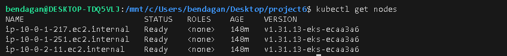

---

## 🚀 CI/CD Pipelines (Jenkins)

The project utilizes **Jenkins** running within the cluster. A key feature of this implementation is the use of **Dynamic Build Agents**. Instead of static executors, Jenkins spins up ephemeral Pods for each build, ensuring resource efficiency and clean build environments.

**System Health Dashboard:**
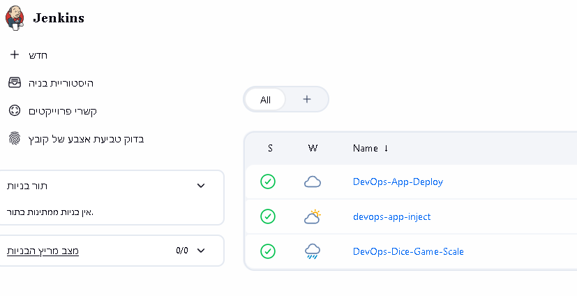

**Dynamic Agent Provisioning (Proof of Concept):**
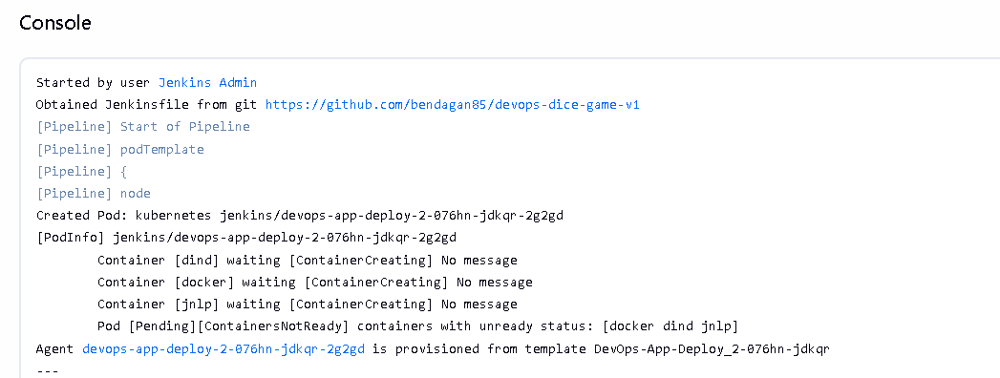

### 1. CI/CD Pipeline (Build & Deploy)
* **Trigger:** SCM (Git) changes / Pull Requests.
* **Stages:** Build Docker Image → Push to Private Hub → Helm Upgrade.
* **Outcome:** Automatic deployment to the `devops` namespace.

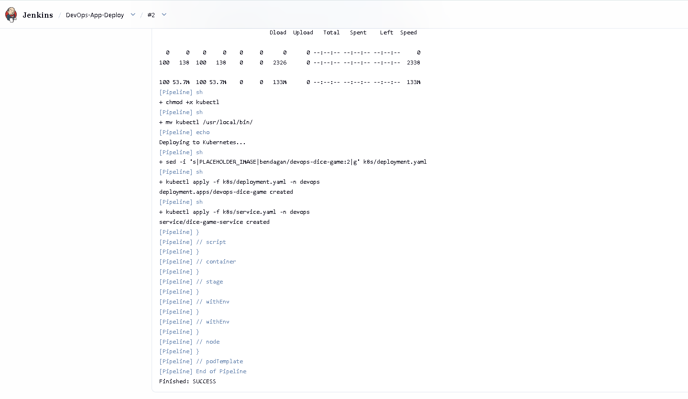

### 2. Operational Pipeline: Scaling Management
Allows DevOps engineers to control the number of replicas and update image tags dynamically via the Jenkins UI.

**Parameter Input:**
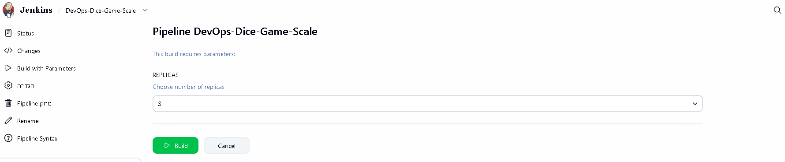

**Result:** Scaling to 3 Replicas successfully applied:
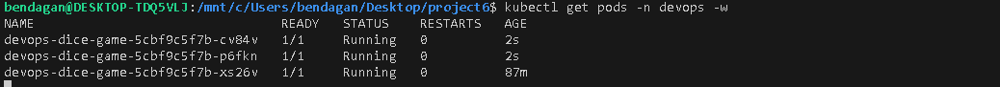

### 3. Operational Pipeline: Live Configuration Injection
A specialized pipeline designed to inject configuration files or secrets into **running pods** without requiring a restart or redeployment.

**Parameter Input (Secret Content):**
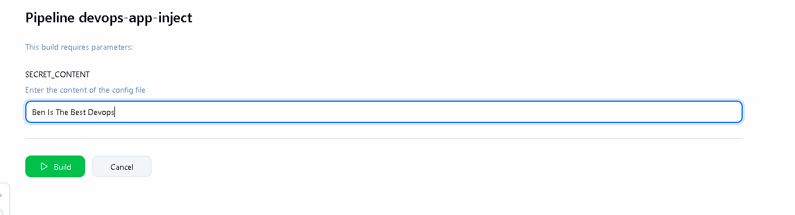

**Verification:** Validating the file existence inside the pod:
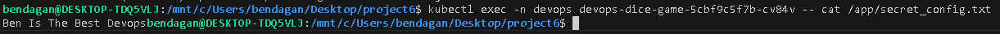

---

## 🔒 Security & Networking

The application is exposed via an **Nginx Ingress Controller**, enforcing HTTPS termination and routing traffic to internal ClusterIP services. Direct external access to pods is blocked.

* **Ingress Controller:** Nginx
* **Termination:** TLS/SSL (Self-Signed for demo purposes)
* **Service Type:** ClusterIP (Internal only)

**Secure HTTPS Access (Browser):**
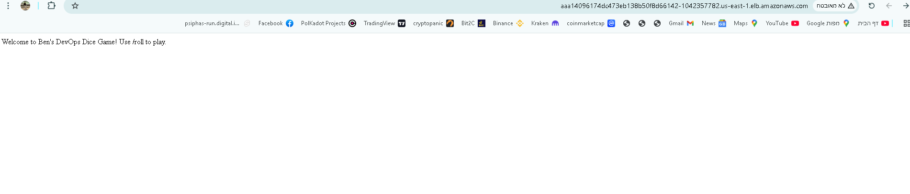

**Ingress & LoadBalancer Correlation:**
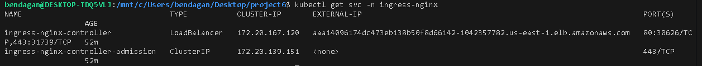

---

## 📈 Observability & Auto-Scaling (HPA)

The system implements **Horizontal Pod Autoscaling (HPA)** based on CPU utilization. A Metrics Server collects real-time data, allowing Kubernetes to automatically scale pods up during high load and scale down during idle times.

* **Metric:** CPU Utilization
* **Threshold:** 50%
* **Max Replicas:** 10

**HPA Status (Metrics Active):**
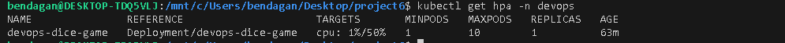

---

## 🔌 API Usage

The application exposes a REST API for game interaction.

**Endpoint:** `GET /roll`
**Response:** JSON format containing the dice roll result.

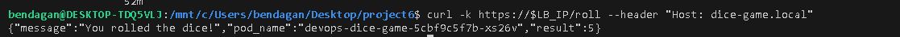

---

## 🛠️ Prerequisites & Installation

To deploy this project from scratch:

1.  **Clone the repository:**
    ```bash
    git clone [https://github.com/your-user/devops-dice-game.git](https://github.com/your-user/devops-dice-game.git)
    ```
2.  **Provision Infrastructure:**
    ```bash
    cd terraform
    terraform init
    terraform apply
    ```
3.  **Deploy Jenkins:**
    ```bash
    helm install jenkins jenkins/jenkins -n jenkins --create-namespace
    ```
4.  **Configure Pipelines:** Import the `Jenkinsfile`s located in the `pipelines/` directory.


**Tech Stack:** AWS, Terraform, Kubernetes, Docker, Jenkins, Python (Flask), Nginx.
